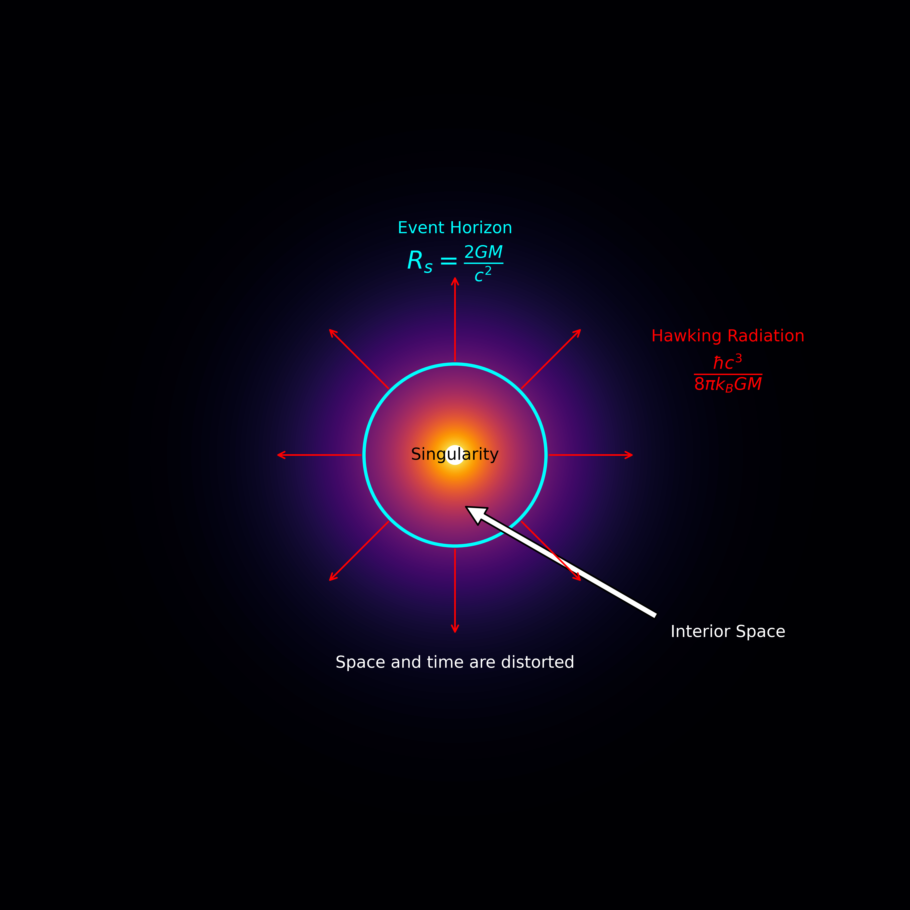

# Quantum_T-shirt_img_generator

The script generates a visualization of a black hole with its accretion disk, event horizon, singularity, and Hawking radiation. It utilizes theoretical physics equations to calculate and display the Schwarzschild radius and simulate the accretion disk around a black hole.

